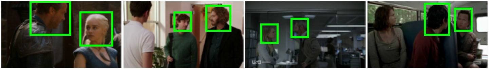

# UCO-LAEO: an annotated database for training and evaluating LAEO models

<div align="center">
    
</div>

### Description 
We use four popular TV shows: ‘Game of thrones’, ‘Mr Robot’, ‘Smallville’ and ‘The walking dead’. From these shows, we collect 129 (3-12 seconds long) shots and first annotate all the heads
in each frame with bounding boxes, and then annotate each head pair as LAEO or not-LAEO.

# Download
Available soon.

### Evaluation protocol
(TBA)

### References
```
@inproceedings{marin19cvpr,
  author    = {Mar\'in-Jim\'enez, Manuel J. and Kalogeiton, Vicky and Medina-Su\'arez, Pablo and and Zisserman, Andrew},
  title     = {{LAEO-Net}: revisiting people {Looking At Each Other} in videos},
  booktitle = CVPR,
  year      = {2019}
}
```
